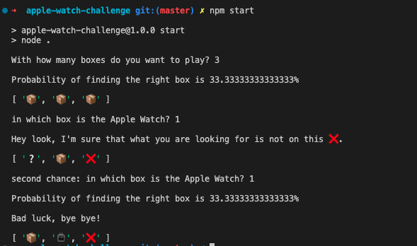
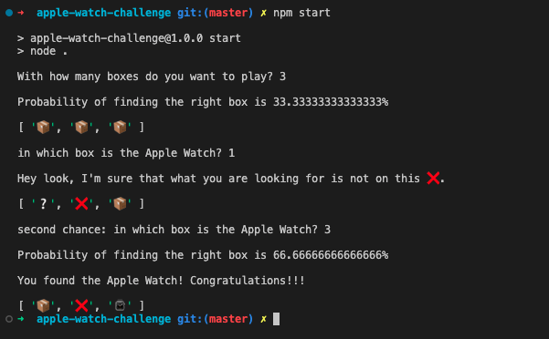
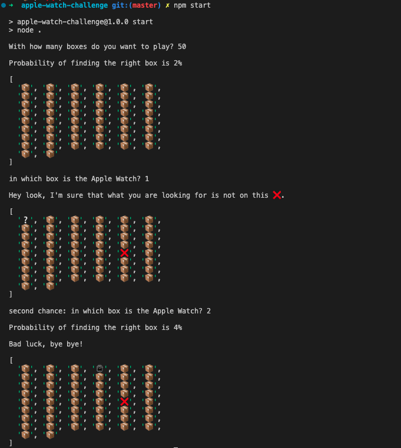

## the challenge

There are three boxes, and only one of them contains the long-awaited Apple Watch, which you can win if you guess which one it is.
The boxes are shuffled, and as soon as you choose one of them, the program will show you a different one - which will be empty (the program knows where the reward is!).
As a player, it is up to you to change your initial choice. Do you keep your original guess or change the box you chose?
Your task is to write a program that simulates the above-mentioned problem and a function that proves which would be the best choice, change your guess or not!
And go further - what would you change if it were fifty boxes?
Now it's up to you. Good luck, little grasshopper!

## execute the program:
> prerequisites: install node

execute `npm start` or `node .`

## simulating scenarios:

simulation of guessing the first box out of three boxes:
IMPORTANT: the program always opens an empty box.

scenarios __keeping__ the original guess:

> chose the first box and kept the original guess
> 
> ['⌚️', '📦', '📦'] = true

> chose the first box and kept the original guess
> 
> ['📦', '⌚️', '📦'] = false

> chose the first box and kept the original guess
> 
> ['📦', '📦', '⌚️'] = false

__RESULT = 1/3   33%__

scenarios __changing__ the original guess:

> chose the first box
> 
> ['⌚️', '📦', '📦']
> 
> the program show an empty box
> and the player change his guess to the other box
> 
> ['⌚️', '❌', '📦'] = false

> chose the first box
> 
> ['📦', '⌚️', '📦']
> 
> the program show an empty box
> and the player change his guess to the other box
> 
> ['📦', '⌚️', '❌'] = true

> chose the first box
> 
> ['📦', '📦', '⌚️']
> 
> the program show an empty box
> and the player change his guess to the other box
> 
> ['📦', '❌', '⌚️'] = true

__RESULT = 2/3   66%__

## Prints:

### If you keep the original choice you stay with the same probability (33%)

### BUT if you change your choice choice you can get advantage of probability you initially had to loose (66%)

### I would do the same with fifty boxes jumping from 2% to 4%!

> Me dá esse Apple Watch!
>
> 21 Quebrando a Banca 😂